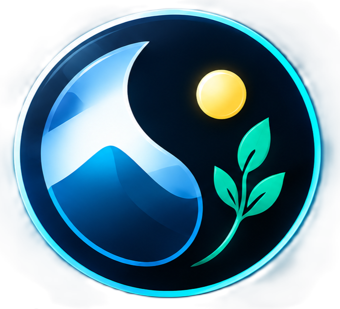
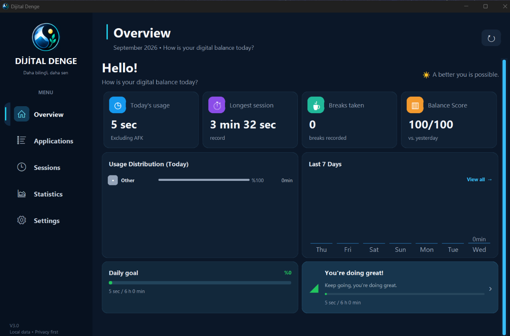
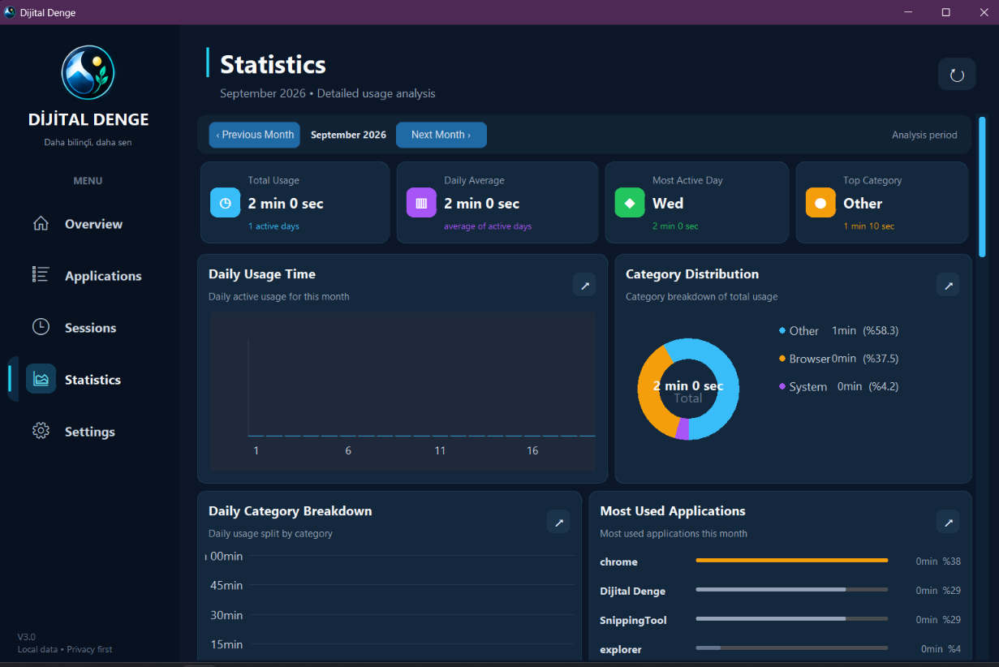
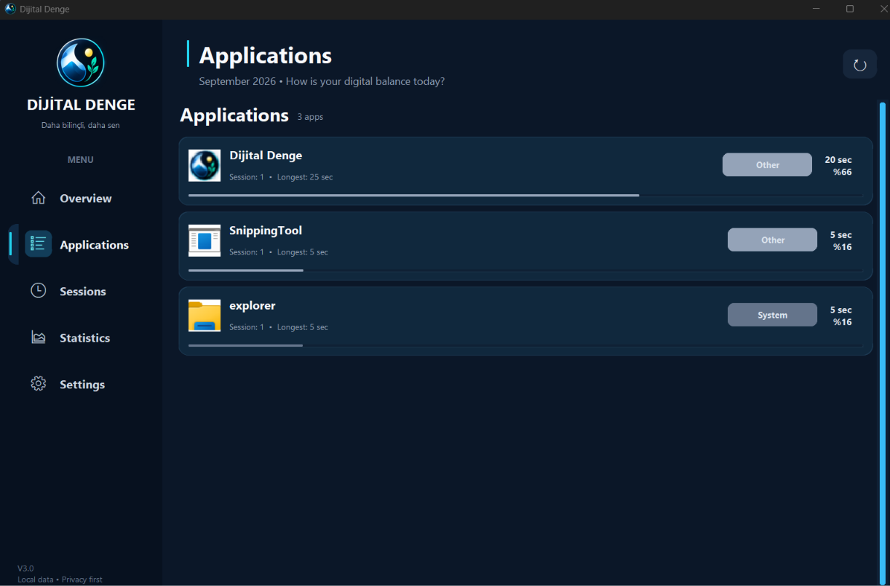
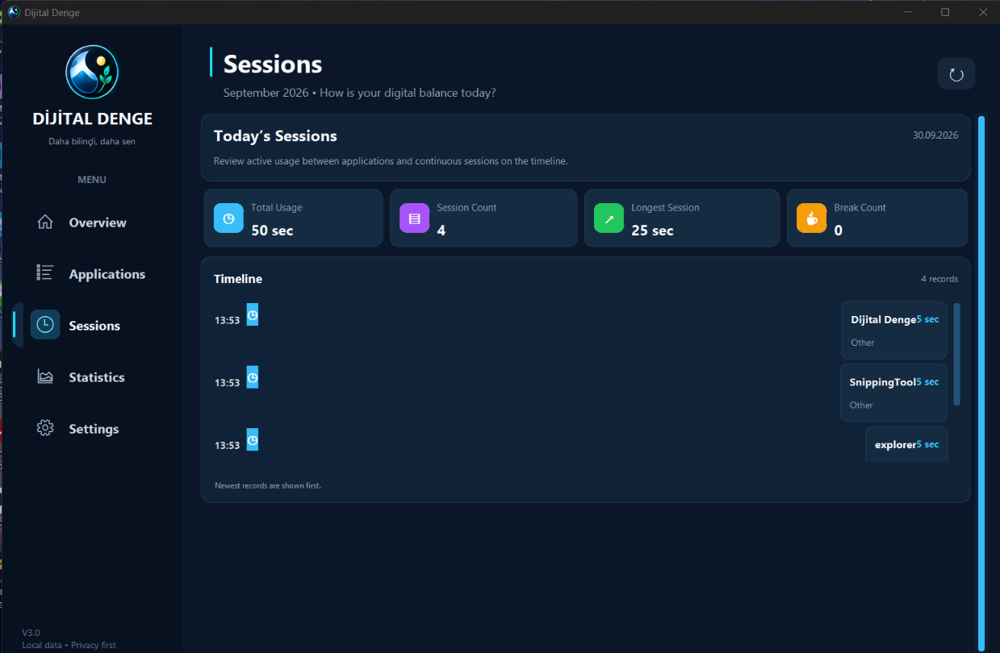
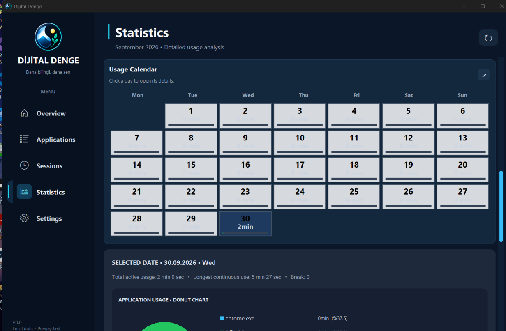
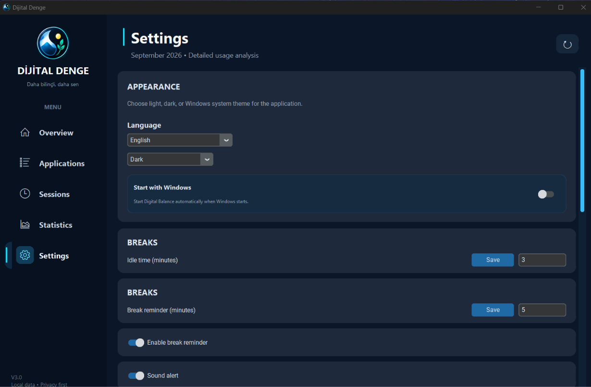

<div align="center">



# Dijital Denge

### Understand your screen time. Build better digital habits.

A modern Windows desktop application that tracks computer usage,
analyzes your digital habits, and helps you maintain a healthier balance
between productivity and screen time.

<br>


<br>

[Features](#-features) •
[Dashboard](#-dashboard) •
[Analytics](#-analytics) •
[Privacy](#-privacy) •
[Architecture](#-architecture)

</div>

---

## 🌟 Overview

**Dijital Denge** is a desktop productivity and screen-time tracking
application designed to help users understand how they spend their time
on their computer.

Instead of simply showing total screen time, Dijital Denge provides
a deeper view of your digital activity through:

- 📊 Usage analytics
- 🖥️ Application tracking
- ⏱️ Session tracking
- ☕ Smart break detection
- 🎯 Daily goals
- ⚖️ Balance Score
- 📅 Calendar-based history
- 📈 Usage trends
- 🌍 Multi-language support
- 🎨 Light & Dark themes
- 🔔 Break reminders
- 🖥️ System tray integration

The goal is simple:

> **Use your computer intentionally, understand your habits, and maintain a better digital balance.**

---

# ✨ Features

<table>
<tr>
<td width="50%">

### 📊 Smart Dashboard

Get a quick overview of your current digital activity.

- Today's total usage
- Current application
- Current session
- Longest continuous usage
- Break count
- Balance Score
- Last 7 days overview

</td>

<td width="50%">

### 🖥️ Application Tracking

Understand which applications consume most of your time.

- Application usage
- Usage percentage
- Session count
- Longest session
- Automatic categorization
- Custom categories

</td>
</tr>

<tr>
<td width="50%">

### 📅 Calendar Analytics

Explore your computer usage day by day.

- Monthly calendar
- Daily usage indicators
- Selected-day analytics
- Hourly usage
- Application distribution
- Daily goal status

</td>

<td width="50%">

### ☕ Smart Breaks

Dijital Denge distinguishes between normal app switching
and actual breaks.

- Short breaks
- Long breaks
- Computer-away periods
- Continuous usage tracking
- Break reminders

</td>
</tr>

<tr>
<td width="50%">

### 🎯 Goals

Set personal usage goals and monitor your progress.

- Daily total usage
- Engineering / development goals
- Gaming goals
- Progress indicators
- Goal-based calendar status

</td>

<td width="50%">

### ⚖️ Balance Score

A simple indicator designed to summarize your digital usage patterns.

The score considers usage behavior such as:

- Screen time
- Break habits
- Continuous usage
- Daily goals
- Usage categories

</td>
</tr>
</table>

---

# 🖼️ Interface

### 🏠 Dashboard

<p align="center">
  
</p>

The dashboard provides a clean overview of your current computer
activity and recent usage trends.

---

### 📈 Statistics

<p align="center">
  
</p>

The statistics page provides detailed charts and historical analysis.

---

### 🖥️ Applications

<p align="center">
  
</p>

See which applications you use most and how much time you spend in each one.

---

### ⏱️ Sessions

<p align="center">
  
</p>

Review your application sessions and breaks through a visual timeline.

---

### 📅 Calendar

<p align="center">
  
</p>

Explore your computer usage throughout the month and inspect
individual days in more detail.

---

### ⚙️ Settings

<p align="center">
  
</p>

Customize application preferences including language, theme,
goals, reminders, notifications, and Windows startup options.

---

# 📊 Dashboard

The dashboard is designed to answer the most important questions at a glance:

| Metric | Description |
|---|---|
| ⏱️ Total Usage | Total active computer usage today |
| 🖥️ Current App | Application currently being used |
| 🔄 Current Session | Duration of the current application session |
| 🔥 Longest Continuous | Longest period without a meaningful break |
| ☕ Breaks | Number of breaks taken today |
| ⚖️ Balance Score | Overview of digital usage balance |
| 📈 7-Day Usage | Recent usage trend |

The interface focuses on information that can be understood quickly
without requiring the user to analyze raw data.

---

# 📈 Analytics

Dijital Denge turns raw usage information into visual insights.

### Daily Usage

Track how your computer usage changes from day to day.

### Weekly Comparison

Compare recent usage periods to identify changes in your habits.

### Category Distribution

Understand where your computer time goes.

Example categories:

```text
🛠️ Engineering
💻 Development
📚 Study
📄 Document
🌐 Browser
💬 Communication
🎮 Games
🎬 Media
⚙️ System
